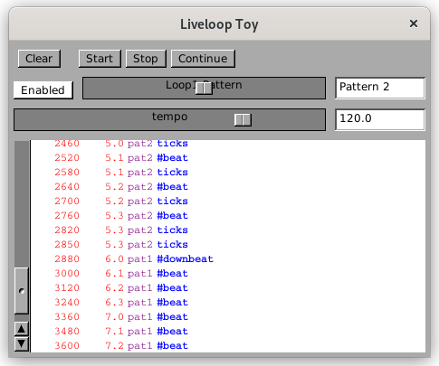

# Liveloop Toy

This demonstration program shows some of the capabilities of "Liveloops" - patterns that may be modified while playing without losing a beat.  A screenshot is shown below.

The metronome control buttons are `[Start]`, `[Stop]` and `[Continue]`.  The `[Start]` button begins playing a song at the beginning.  `[Stop]` pauses playing and `[Continue]` resumes playing from where it stopped.

The `[Clear]` buttton clears the log window.

The `[tempo]` slider adjusts the tempo of the metronome.

The "Liveloop" conttrols are in the second row.  Internally, there is a single Liveloop called "loop1".  The `[Enable]` buttons disables and re-enables the pattern.

The `[Loop1 Pattern]` slider selects between three patterns: Pattern 1, Pattern 2 and Pattern 3.  Each pattern is 8 beats long.  What you should notice about changing patterns *while the metronome is playing* is that the beat never stops while you change patterns

## Try it out!

If you change from Pattern 1 to Pattern 2, Pattern 1 will complete its 8-beat figure and then Pattern 2 will start on the following down-beat.  If you disable the Liveloop, but keep a count in your head or with a foot-tap, you will notice that when it is re-enabled a pattern starts with the next down-beat.  The metronome keeps counting time while a Liveloop is disabled so that when a Liveloop is re-enabled it can start in-sync with the running time.

