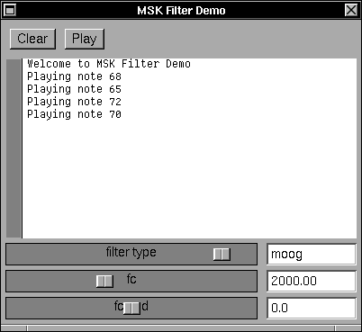

# Filter Demo

A tiny application that plays a tone and presents three sliders for manipulating a filter.

This program demonstrates the creation of an "Effects Chain" (FX) consisting of a single filter.  Two tones sharing a common envelope are created and added to the ocontext for playing.  Each press of the `[Play]` button cause a new random note to be played.  The release time is very long so that a user can change the parameters of the filter.

There are three sliders.

- filter type: which type of filter
- fc: the center frequency of the filter
- fc_mod - modulate the center frequency by +/- 12 semi-tones.

## Implementation Notes

This is a pure GNUstep application using the McLarenSynthKit library.  It creates its GUI programmatically (rather than using an UI Builder tool).

The demo also shows how to use Bindings to connect Controls to MSK Models to change parameter values in real time.
