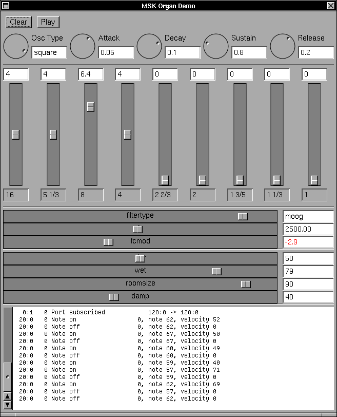

# Organ Demo

This application demonstrates the `DrawbarOscillator` type followed by a filter and a reverb unit.  The application greedily subscribes to all available MIDI devices and plays note messages it sees from any of them, so you can start the application and play an attached MIDI keyboard without any configuration.

The `DrawbarOscillator` implements "sin", "saw", "triangle", "square" and "reverse-saw" waveforms shapes.



## Implementation Notes

Cocoa bindings are used here to connect GUI controls to MSK models.  Cocoa ValueTransformers and and NumberFormatters are also featured.  Note in particular how the "Oscillator Type" and "Filter Type" slider values are rendered as a text string.  This conversion is provided by a ValueTransformer supplied by the respective model.  Also note how a NumberFormatter displays negative `fcmod` values in red.

The basic NSSlider has also been augmented to respond to `scrollWheel` events.  This makes the sliders more convenient with a scroll-mouse or trackpad!


## Playing other Devices

Without an output audio selector, the way to change the selected output is by changing the name of the audio device opened.  For example, in `MskOrganDemo_AppDelegate.m` this line sets the name of the audio chosen.

    NSString *devName = @"default";

Use the program called `askpcmlist` in Tools to see the available audio devices.

``` console
$ obj/askpcmlist
2024-02-03 08:38:30.601 askpcmlist[238347:238347] device-name:hw:0,0 display-name:ALC256 Analog
2024-02-03 08:38:30.601 askpcmlist[238347:238347] device-name:hw:0,3 display-name:DELL S2421NX
2024-02-03 08:38:30.601 askpcmlist[238347:238347] device-name:hw:0,7 display-name:HDMI 1
2024-02-03 08:38:30.601 askpcmlist[238347:238347] device-name:hw:0,8 display-name:HDMI 2
2024-02-03 08:38:30.601 askpcmlist[238347:238347] device-name:hw:0,9 display-name:HDMI 3
2024-02-03 08:38:30.601 askpcmlist[238347:238347] device-name:hw:1,0 display-name:USB Audio
2024-02-03 08:38:30.601 askpcmlist[238347:238347] device-name:null display-name:null
2024-02-03 08:38:30.601 askpcmlist[238347:238347] device-name:default display-name:default
2024-02-03 08:38:30.601 askpcmlist[238347:238347] device-name:pulse display-name:pulse
```

This shows that there is an external USB Audio device on my system.  To play audio out of it, use the "device-name" to choose this device instead of the default.

    NSString *devName = @"hw:1,0";

Recompile the program, and audio will play out of the USB audio device recognized by the OS as hardware audio card number 1.
