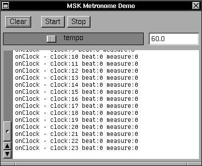
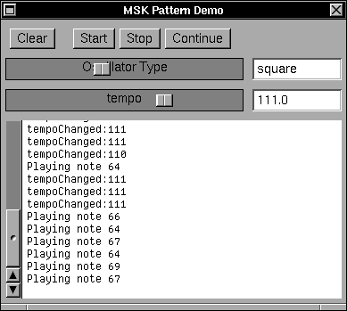

# Metronome Demos

There are two demonstration programs in this directory.  They show off the Metronome and Patterns.

The Metronome demonstration plays a 4/4 beat with different notes for the downbeat and beats 2, 3, 4.

The Pattern demonstration uses the new Pattern facility to play a repetitive tune.  The tempo and waveform can be varied as the pattern plays.  This app also demonstrates the start/stop/continue functionality of the metronome.

## The Tests directory

The small programs in the Tests directory were used to exercise the Pattern facility as it was developed.  They range in complexity from extremely small focused tests, to larger demonstrations of Pattern capabilities.
