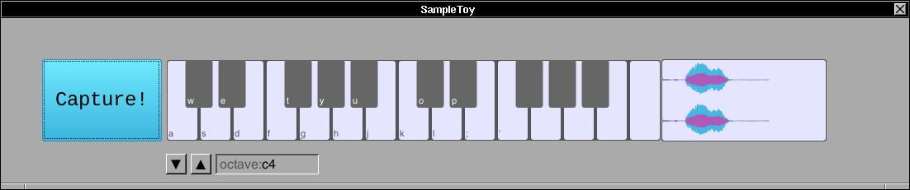

# Sample Toy

This application demonstrates the use of the Sample capabilities of the McLaren Synth Kit.  There is a single large button on the left, that when pressed, captures an audio sample from the "default" audio input on your computer.  Once captured, it is displayed in the WaveForm view on the right.  Then, the sample can be "played" at different pitches using the keyboard.  Middle "C" (mapped to the key "k") plays the sample at its normal pitch.



## Features

This application shows some interesting parts of the Synth Kit.

1. Capture Context: while many applications in this repository feature sound synthesis, this one features opening a context for capture and writing the data to a Sample.

2. Resampling: [libresample](https://github.com/minorninth/libresample/tree/master) is included in most Linux distributions.  This demo shows how MSK makes use of it.

3. Save: the current sample can be saved to a file in a number of formats (au, wav, ogg, etc).

4. Load: load a sample from a file for playing on the keyboard.

## Usage

Start the program.

``` console
openapp ./SampleToy.app
```

Using system audio controls, set the "default" input for capturing and default output for playing.

## Use a good quality microphone

This application does not implement noise reduction in the input path, so a high quality external microphone is recommended.  We like to use a [Snowball](https://www.logitechg.com/en-us/products/streaming-gear/snowball-ice-usb-microphone.988-000070.html).


## Building

If you have installed libAlsaSoundKit (ASK) and the McLaren Synth Kit (MSK) globally, then you should be able to type

    $ make

If you are working locally, with libAlsaSoundKit and libMcLarenSynthKit left in place, use the "localdev" option we have provided.

    $ make localdev=yes

## Implementation Notes

The program performs on-the-fly resampling to change the pitch of the sample.  Latency is fine for this demo.  A more performant application might do the resampling ahead of time.


