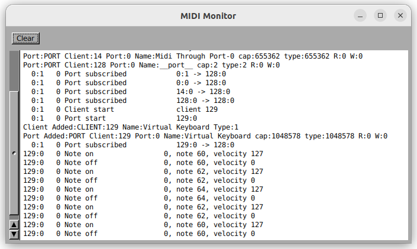

# MIDI Monitor

A little application that watches all ALSA clients in the system and logs event information to a window.

This program differs from the alsa-utils program "aseqdump" in that instead of watching the events from a specific client:port, it automatically finds clients.  It watches for new clients starting and old clients stopping and watches/unwatches them.

## Implementation Notes

This is a pure GNUstep application using the AlsaSoundKit library.  It creates its GUI programmatically (rather than using an UI Builder tool).  For layout, it uses the rather antiquated but still useful GSTable,GSHbox and HSVbox.
