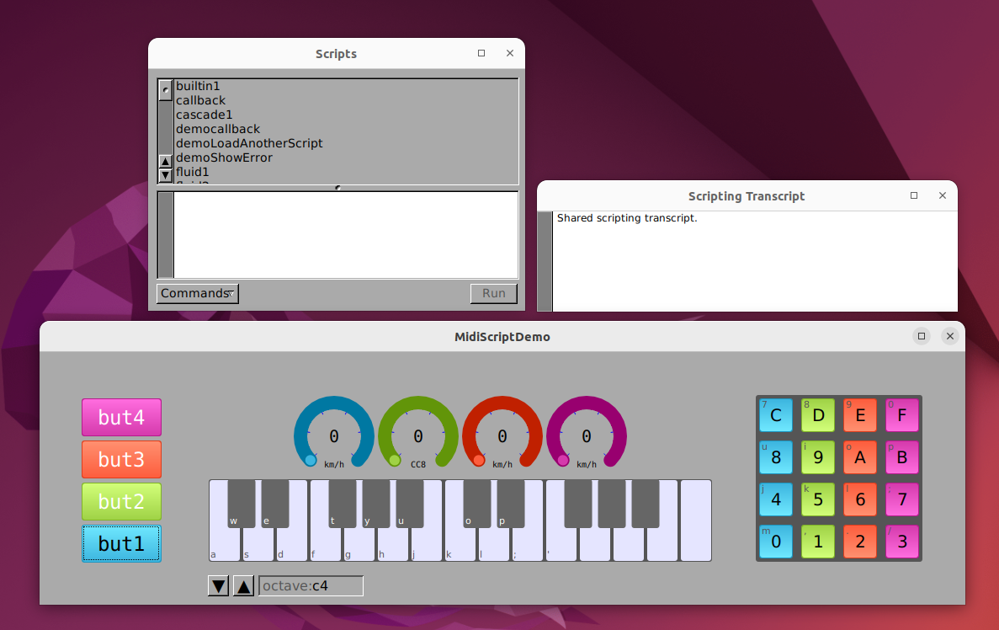

# Midi Script Demo

This application demonstrates using [StepTalk](https://github.com/gnustep/libs-steptalk/) to configure and coordinate MIDI and Audio objects using the McLaren Labs' [AlsaSoundKit](https://mclarenlabs.github.io/McLarenSynthKit/).

This application provides a collection of widgets that can be configured in various ways using StepTalk.  Think of it as a ["100-in-one kit"](https://www.sparkfun.com/news/1747) for building MIDI utilities with a scripting language: StepTalk.  Instead of electrical components, we have widgets, and instead of wires, we have StepTalk scripting and messages.

## Usage

When you start the application, you will see the main window with the widgets, and two other windows.  The one on the left in the figure is the "Script" window.  It is here that you can select a script and run it: either by clicking the "Run" button, or by double-clicking the script name.  The Script window has a white text area below, this is where descriptions of the script will appear if there is one.

The window on the right is the "Transcript" window.  This is where scripts can write output.



## Building

If you have installed libAlsaSoundKit (ASK) globally, then you should be able to type

    $ make

If you are working locally, with libAlsaSoundKit left in place, use the "localdev" option we have provided.

    $ make localdev=yes

## StepTalk

StepTalk is an interpreted SmallTalk dialect built on-top of the GNUstep Objective-C runtime system.  StepTalk programs can create and interact with Objective-C objects.  Objective-C classes can be instantiated, and methods may be invoked using SmallTalk syntax.  Selectors in StepTalk map directly to selectors in Objective-C.

In this demonstration program, we have provided MIDI and Audio classes that can be accessed through scripts.  Below is a small example that creates and sends a noteOn message from StepTalk using the McLaren ASKSeqEvent class.  Note 60 is sent without scheduling in the future (this is called "direct"), and it is sent to all subscribers (setSubs method).

``` smalltalk
midiNote := 60.

ev := ASKSeqEvent eventWithNoteOn:midiNote vel:127 chan:0.
ev setDirect.
ev setSubs.
seq output:evOn.
```


MidiScriptDemo provides the following widgets and objects.

* Buttons

  There are four buttons on the left.  Each can be configured with a specific midiNote value.  When pressed, the button emits a `butNoteOn:` message, and when released emits a `butNoteOff:` message.  In addition, while the mouse is dragged, the button emits a `butKeyPressure::` message that can be used to modulate another value.
  
  The buttons may also be played through your laptop keyboard with the `<SPACEBAR>`.
  

* Gauges

    There are four gauges on the top.  Each can be configured with an allowable range, permitted step size, value format and label string.  When adjusted, a Gauge sends a message to its target.  Gauges can be adjusted with the mouse or scroll button.
	
* Piano Keyboard

    The Piano keyboard displays white and black keys.  When pressed, each key emits a `pianoNoteOn:` message, and when released emits a `pianoNoteOff:` message.  They Piano keyboard can be played from your laptop keyboard.  To permit more musical playing, the Piano disables key-repeat so that you can hold down notes.

* Pad

    The Pad is a 4x4 array of buttons - sizeteen in total.  When pressed, each emits a `padNoteOn:` message for a specific midiNote and when released emits a `padNoteOff:` message.  The Pad has keyboard accelerators as well as the Piano and may be played from your laptop keyboard.

* Tone Generator

    The Tone Generator is a very simple monophonic synthesizer that is started whenever MidiScriptDemo is running.  It has no GUI component, but exposes itself as `toneGen` to the scripting environment which may "play" it.


### Why does each script instantiate a Sequencer interface

Scripts that need to send and receive MIDI each instantiate their own ALSA Sequencer client and name it "seq".  Each script also creates a MIDI event dispatcher and calls it "disp".  It might have been a better idea for the main application to create these once, and allow each script to use them as seen fit.

I've left it as it is since some of these scripts show the interesting capabilities of StepTalk.  For example, in the script name "VirtualKeyboard.st" you will see the following lines.

``` smalltalk
"Set the property 'sequencer_name' on an options object"
opts := ASKSeqOptions alloc init.
opts setSequencer_name:clientName.
```

Something very interesting is happening here.  There is a property called "sequencer_name" of type `char*`.  A setter has been generated for this property named `setSequencer_name:`.  StepTalk inspects the method signature of `setSequencer_name:` and is smart enough to know how to coerce a StepTalk string (`NSString`) into a `char*` for the setter.

There is another interesting construct illustrated in the instantiation of the ASKSeq sequencer port.

``` smalltallk
"Configure and start the sequencer"
errp := NSErrorPtr alloc init.
seq := ASKSeq alloc initWithOptions:opts error:errp.
```

An `NSErrorPtr` is an object that holds an `NSError*`.  It is part of this project so that StepTalk can invoke methods that have an `NSError**` parameter.

Such a method is the ASKSeq init method:

``` objc
// customize the sequencer options
- (id) initWithOptions:(ASKSeqOptions*)options error:(NSError**)error;
```

When StepTalk is presented with an `NSErrorPtr*` to pass to a parameter that expects an `(NSError**)`, it invokes the `pointerValue` method on the `NSErrorPtr*`, which has been defined to return the address of the `NSError*` it holds.  This might be a little bit obtuse, but it's pretty interesting.  StepTalk makes good use of the signatures of methods, including the argument types.

## Main Thread

All events processed by a script are handled on the Main Thread.  The scripting interpreter is not thread safe.  By default, GUI events are processed on the Main Thread, so interactions with GUI elements are safe.

In this application, MIDI events processed by scripts must be transferred to the Main Thread.  The ASKSeq interface delivers Sequencer Events on an unspecified dispatch queue.  Before handling by a thread, they must be transferred to the Main Thread.  This is done by the ASKSeqDispatcher, which arranges for MIDI events to arrive on the Main Thread, which are then delivered to various selectors on a target.

## Debugging

A good practice is to set the NSExceptionHandlerMask to "3".  This can help identify typos in your scripts.

    $ defaults write NSGlobalDomain NSExceptionHandlerMask 3

This will log the exception, and put run a GUI Panel to display the error.

(The meanings of these values are defined in NSApplication.m).

    #define NSLogUncaughtExceptionMask 1
    #define NSHandleUncaughtExceptionMask 2
    #define NSLogUncaughtSystemExceptionMask 4
    #define NSHandleUncaughtSystemExceptionMask 8
    #define NSLogRuntimeErrorMask 16
    #define NSLogUncaughtRuntimeErrorMask 32


It can also be helpful to turn on various debugging logs.


    $ openapp ./MidiScriptDemo.app --GNU-Debug=dflt --GNU-Debug=STEngine --GNU-Debug=STBytecodeInterpreter --GNU-Debug=STExecutionContext --GNU-Debug=STSending


## Script Objects

StepTalk scripts are parsed and become a STSmalltalkScriptObject object.  Three method names have special significance:

* startUp
* main
* shutDown

These are simply called in order when the script is loaded, and most scripts only define main.

Methods in script objects may invoke any Objective-C class or method.  To the ObjectiveC runtime, the script object behaves as any other object and responds to messages.

## Script Locations

The StepTalk executor looks for scripts in known locations.  For MidiScriptDemo, these are:

* MidiScriptDemo.app/Resources/Scripts
* ~/GNUstep/Library/StepTalk/MidiScriptDemo
* /usr/GNUstep/Local/Library/StepTalk/Scripts/MidiScriptDemo

We have provided some example scripts that will be located in the Application bundle itself.  If you are writing your own, it's a good idea to develop and debug with them in one of the other locations.

## Script Classes

Currently, there is not a provision in StepTalk for defining classes through scripting.


## Retaining the Script

A StepTalk script may be executed for its side effects (configuring widgets, for example) or may be intended to provide methods that will be called by the main program.  The latter is a case of script "embedding".

When a script is executed, the script is loaded, parsed, executed and then reclaimed by the garbage collector.

This process works fine for side-effects.  But if the script is intended to be embedded in the main process, some mechanism must be established for retaining the script while it is being executed.

One way we like to do that is to place a reference to the ScriptObject (identified by `self`) in the environment.  We like to use a consistent name.

``` smalltalk
currentScript := self.
```

This way, the current script has an easy to identify name ("currentScript") and it is properly retained.


## Other Retain Issues

Cocoa controls and cells do not retain their target (see NSActionCell.m).  We have kept that pattern for the target/action of the ML MIDI controls.  But it is inconvenient when the target is an object in a script that is not ordinarily retained.

Take the code example below.  It would be really nice to be able to set the target of a control to a StepTalk block.  The problem is that it is not retained.

    gauge setAction:#value:.
    gauge setTarget:[ :sender |
	   Transcript showLine:('got value', sender doubleValue description).
	].

Instead, we have to assign the block to a (global) variable so that it is retained.

    gauge setAction:#value:.
    theBlock := [ :sender |
	   Transcript showLine:('got value', sender getDoubleValue description).
	].
	gauge setTarget:theBlock.


## The Scripting environment

By default, the Scripting Environment will be loaded with the symbol `Application` which corresponds to NSApplication, and the symbol `Transcript` which is the output log window.

Classes and Objects loaded by MidiScriptDemo are listed in the file `ScriptingInfo.plist`.  The StepTalk framework reads this automatically.

The scripting Environment can be accessed and modified too.

Interesting things to do

	Application scriptingEnvironment loadModule:'ObjectiveC'.
	Application scriptingEnvironment loadModule:'AppKit'.
	Application scriptingEnvironment loadModule:'Foundation'.

	Environment loadModule:'ObjectiveC'.
	Environment loadModule:'AppKit'.
	Environment loadModule:'Foundation'.
	
    cnt := Application scriptingController.
    Transcript showLine:('Controller', cnt description).

	

Look at all of the methods using `methodNames`.

	Application methodNames description
	
Load a script called `callback.st` located somewhere in the paths.

    sm := STScriptsManager alloc init.
    Transcript showLine:('sm', sm description).

    sc := sm scriptWithName:'callback' .
    Transcript showLine:('sc', sc description).

    eng := STEngine engineForLanguage:'Smalltalk'.
    Transcript showLine:('Engine', eng description).
	
	env := Application scriptingEnvironment.
	Transcript showLine:('Environment ', env description).

    src := sc source.
    Transcript showLine:('Source', sc fileName).
  
    callback := eng interpretScript:src inContext:env.
	
Upon executing this code, the variable named "callback" will hold a reference to the compiled script object named "callback.st".  Methods of this script will be accessible as any other method.

``` smalltalk
results := [callback method:var1 othervar:var2].
```

## Safety and Full Scripting

StepTalk has the concept of "Environments" that define the allowable classes and methods.  By default, the Scripting environment loads the "Standard" environment which includes "Foundation" and "StepTalk".

See

    libs-steptalk/Frameworks/StepTalk/Enviroments/Standard.stenv
    libs-steptalk/Frameworks/StepTalk/Enviroments/Foundation.stenv
    libs-steptalk/Frameworks/StepTalk/Enviroments/StepTalk.stenv

The default application scripting environment is created in NSApplication+additions.m, where you can observe that the "AppKit" module is also loaded.

The mode called "Full Scripting" permits access to classes beyond those in the environment or explicitly added.  This mode is not enabled in MidiScriptDemo.

## Omissions

The classes `NSError` from Foundation and `NSAlert` are not listed in

* Modules/Foundation/ScriptingInfo.plist
* Modules/AppKit/ScriptingInfo.plist

respectively.  I am not sure why.  These classes can be found by enabling "FullScripting" ... whereby any class can be looked up from the ObjC runtime.  But this may be unsafe.  Instead, we are including those classes in our local ScriptingInfo.plist as they are generally useful.

## Miscellaneous remarks

### strange parse errors

      gauge1 setDoubleValue: 127.    "a comment string out here"

### strange file loading errors

One way of loading a script through a script is the following pattern.

``` smalltalk
  sm := STScriptsManager alloc init.
  sc := sm scriptWithName:'demoCallback' .
  callbackScript := Application scriptingController executeScript:sc.
```

In this example, the name of the script to be loaded is in camel case.  However, the executeScript call will complain with the following.

    Error: Execution of script 'demoLoadAnotherScript' failed. Unable to find engine class for language 'Unknown': No bundle.. (StepTalkException)

If the script is renamed to "democallback.st" (all lower case), the script will load and execute successfully.


## To Do

- mechanism to call a "shutdown" method in the current script prior to calling a new script.  Currently, each invocation leaves its side effects in the scriptingEnvironment.  There is no notion of a "current script" so this doesn't make sense as it is currently implemented.  That would also be a convenient place to reset the controls to defaults.

## Future Ideas

* make the widgets prettier

* reset the widgets to a default state prior to loading a new script

* make a Seq and SeqDispatcher standard.  Also provide a MIDI input chooser to make it easy to select external MIDI devices.

* add a volume control and perhaps a VU meter

* devise a means for writing modular StepTalk programs


## Conclusion

StepTalk is remarkably solid and does what it advertises, and coding in SmallTalk feels elegant.  The StepTalk package has not seen active development for almost a decade, but I think there is some new life to be found in the groundwork it laid.  It would be nice to see some interest build around using it in new applications.

I've found the idea of extending a GNUstep application with scripting to be intriguing.  With a few more widgets and an audio widget architecture, something like MidiScriptDemo could be a fun playground for building and experimenting with musical tools.
