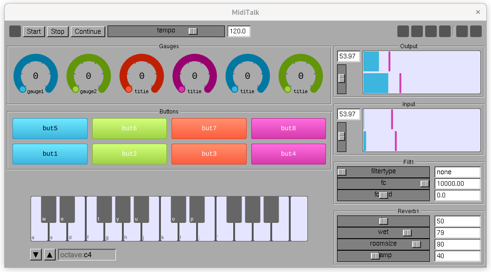

# MidiTalk

``` st
  MidiTalk := MIDI + GNUstep + SmallTalk + StepTalk
```

## Screenshot




## Introduction

MidiTalk is a scriptable application for manipulating MIDI, Audio and Patterns in real-time using a scripting language called StepTalk.  MidiTalk comes with a large collection of predefined classes and objects so that it is easy to create customized applications with small scripts.  Most scripts simply provide the "glue" that connect objects in interesting ways for a particular application.

What are some of the ways that you can use MidiTalk?

- a programmable virtual control surface
- a MIDI translator and processor
- a programmable Synth
- a programmable arpeggiator


MidiTalk is built on the foundation of the [GNUstep](https://gnustep.github.io) programming environment and the StepTalk interpreted language.  StepTalk interfaces directly with Objective-C objects and classes.  All Objective-C classes (including Foundation and AppKit) can be scripted by StepTalk, which makes it very powerful.

In the MidiTalk application, the McLaren Labs Objective-C libraries known as the `AlsaSoundKit` and `McLarenSynthKit` are used to manage MIDI and Audio devices on Linux.  StepTalk can be used with these with no modifications to the libraries themselves.  The MidiTalk application simply provides a GUI with a small collection of widgets that are useful for MIDI and audio.   The rest is done with scripts.

## Documentation

The MidiTalk book is available at the following URL.

* https://mclarenlabs.com/miditalk/miditalk-book.pdf


## An Example

The example script below shows how to make a synth sound and connect the on-screen piano keyboard to play it.  It consists of two methods: `configurePiano` and `main`.

The `main` method is called first when a script is loaded.  Here it creates an instance of the `Synth80` class and assigns it to the variable "synth".  Synth80 is a McLaren Labs synthesizer program that accompanies MidiTalk.  The Synth80 initializer sets its output to `ctx` - the default audio output context of MidiScript. The "FatBass" patch is then loaded into this instance of Synth80 for playing.

The `configurePiano` method is then called.  This method is interesting: it registers two blocks that are called on the "noteOn" and "noteOff" events of the on-screen piano keyboard.  These blocks receive two arguments: the `midiNote` played and the `vel` (velocity) of the keypress.  MidiTalk maps input MIDI events to StepTalk, which then calls these blocks to handle the events.

``` st
"Demonstration: connect the keyboard to a synth sound"
[|

configurePiano

  piano onNoteOn: [ :midiNote :vel |
    synth noteOn:midiNote vel:vel .
  ] .

  piano onNoteOff: [ :midiNote :vel |
    synth noteOff:midiNote vel:vel .
  ] .
!

"the main method is called when the script is loaded"
main
  synth := Synth80Synth alloc initWithCtx:ctx .
  synth loadPatch:'FatBass' .

  self configurePiano .

]
```


