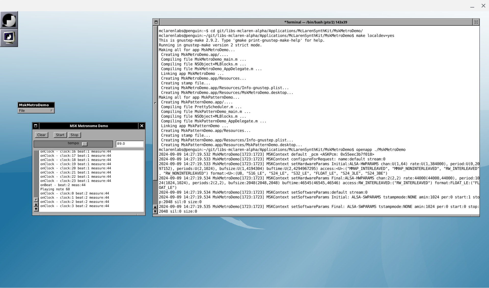

# Run GNUstep Apps on Chromebook Well

The Chromebook Linux subsystem (Crostini) makes a very nice environment for compiling and running GNUstep applications, with one giant exception: the Chromebook window manager does not know how to manage the resulting GNUstep application windows and menus.

The solution is the BASH script here called "startgs1.sh".   It starts a new X-windows session running in a Chromebook window that is managed by a compliant window manager.  Inside this new environment GNUstep applications run nicely.

## Explanation

This is pretty frustrating, I know. The Chromebook Linux environment is actually a really great development environment, but the integration with the Chromebook window manager is not quite right for GNUstep apps. My experience with a GTK-based app is that integration is nearly flawless, but not so for GNUstep.

GNUstep applications want to manage window position in some way that the Chromebook WM doesn't understand. (I suspect it has something to do with WM_HINTS property in X11, but I don't know enough about that. Note that when you open the MskMetroDemo is is always in the center of the screen. If it was working properly, it would open in the position where you last left it. The menus are behaving the same way - always right in the center of the screen.

The workaround I've developed is to launch a separate X11 session in a window where all of the GNUstep development is running. In this X11 environment, WindowMaker is the window manager and it understands GNUstep.

I make the X11 window Fullscreen, and then move it to a separate Desktop. Use the "[ ]||" key to show the desktops, and then drag the Xephyr window onto Desktop 2. (Or on to your external monitor.)

Then I can use the CMD-[ and CMD-] keys to move between the Chrome desktop and the X11/GNUstep desktop. See the screenshot below for what it looks like running Xephyr with WMaker window manager, gs-terminal and the MskMetroDemo app.

