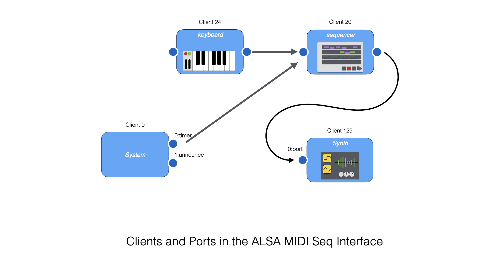

# Alsa Sound Kit

The Alsa Sound Kit (ASK) provides Objective-C wrappers around ALSA MIDI devices and ALSA PCM (sound) devices.  The Alsa Sound Kit depends on `libasound.so` and not much else except Obj-C and Foundation.  The Alsa Sound Kit can be used without the Mclaren Synth Kit.

A dependency graph is shown below.


The purpose of the Alsa Sound Kit is to make it easier to use ALSA MIDI and Sound devices by doing more than wrapping the C-level ALSA functions.  The Alsa Sound Kit provides subroutines for enumerating the devices in your system and for monitoring their status.  The Alsa Sound Kit relieves you (the programmer) from managing threads.  Instead, you set up your program to respond to MIDI events on a dispatch queue, or to respond to Audio events in a block.

## ALSA MIDI System Overview

ALSA can expose MIDI devices as either "Sequencer" objects or "Raw MIDI" objects.  Raw MIDI exposes the MIDI devices of sound cards and and sends and receives raw MIDI byte sequences.

Sequencer objects are a more abstract representation of the MIDI system.  At the Sequencer level, the MIDI system consists of a collection of "clients".  A "client" has one or more "ports".  Interconnections between "ports" are made to describe a MIDI processing graph.



On Linux, the `aconnect` commands can help you about the connections between your MIDI Sequencer clients.  To list the clients on your system try the command below.

``` console
$ aconnect -i -o -l
client 0: 'System' [type=kernel]
    0 'Timer           '
    1 'Announce        '
client 14: 'Midi Through' [type=kernel]
    0 'Midi Through Port-0'
client 24: 'Launchkey 25' [type=kernel,card=2]
    0 'Launchkey 25 MIDI 1'
    1 'Launchkey 25 MIDI 2'
client 130: 'Virtual Keyboard' [type=user,pid=77517]
    0 'Virtual Keyboard'
```

All systems have "client 0" and client 14".  Client 0 is a special System Client that announces events about the MIDI system itself.  It announces the insertion and deletion of new devices in the system.  Client 14 is another special client that is a MIDI pass through.

On our system, we are running a GUI "Virtual Keyboard" program called `vkeybd` that is exposed as client 130.  We have also plugged in a USB keyboard (a Novation LaunchKey 25) and that is exposed as client 24.

The `aseqdump` command on Linux is a command line MIDI monitor.  Use it to watch the events flowing through a specific port on a client.  For instance, you can see the events produced by a MIDI USB keyboard as shown below.  In this example, we played "C-D-E-F-G" on the keyboard.

``` console
$ aseqdump -p 24:0
Waiting for data. Press Ctrl+C to end.
Source  Event                  Ch  Data
 24:0   Note on                 0, note 60, velocity 33
 24:0   Note off                0, note 60, velocity 49
 24:0   Note on                 0, note 62, velocity 38
 24:0   Note on                 0, note 64, velocity 37
 24:0   Note off                0, note 62, velocity 38
 24:0   Note on                 0, note 65, velocity 29
 24:0   Note off                0, note 64, velocity 43
 24:0   Note off                0, note 65, velocity 68
 24:0   Note on                 0, note 67, velocity 48
 24:0   Note off                0, note 67, velocity 76
```

ALSA MIDI Sequencer devices can also be referred to by name, or by partial name.  Instead of referencing client "24" we can obtain the same effect by using the client name "Launchkey 25" or just a unique client-name prefix like "Launch".  Note that because there are spaces in the name, you need to use the correct quoting.

``` console
$ aseqdump -p 'Launchkey 25:0'
Waiting for data. Press Ctrl+C to end.
Source  Event                  Ch  Data
 24:0   Note on                 0, note 60, velocity 17
 24:0   Note off                0, note 60, velocity 56
 24:0   Note on                 0, note 62, velocity 45
 24:0   Note off                0, note 62, velocity 74

$ aseqdump -p Launch:0
Waiting for data. Press Ctrl+C to end.
Source  Event                  Ch  Data
 24:0   Note on                 0, note 60, velocity 60
 24:0   Note off                0, note 60, velocity 45
 24:0   Note on                 0, note 62, velocity 34
 24:0   Note off                0, note 62, velocity 74
```

The MIDI "System Client" (client 0) is special.  Instead of handling note events, this sequencer handles timing events and events about the system on its Port 1.  Run the command below and unplug the USB MIDI Keyboard and then plug it back in.  The System Client announces what is happening.  In the example below you see the following thing: the "Port Subscription" is the `aseqdump` command itself registering with client-0:port-0.  The rest of the output is information about Client 24 (our Launchkey 25).

``` console
$ aseqdump -p 0:1
Waiting for data. Press Ctrl+C to end.
Source  Event                  Ch  Data
  0:1   Port subscribed            0:1 -> 128:0
  0:1   Port exit                  24:0
  0:1   Port exit                  24:1
  0:1   Client exit                client 24
  0:1   Client start               client 24
  0:1   Port start                 24:0
  0:1   Port start                 24:1
```

The `aconnect` command is usually used to make connections between clients and ports.  We can explore its use with just a keyboard and the `aseqdump` command to illustrate how it works.

First, start the `aseqdump` command running in one window with no arguments, like this.

``` console
$ aseqdump
Waiting for data at port 128:0. Press Ctrl+C to end.
Source  Event                  Ch  Data
```

We can see that a new client was created with number 128.  This is a Sequencer Client created for the `aseqdump` command itself.

Now, in another window, make a connection from the external keyboard to Client 128.

``` console
$ aconnect 24:0 128:0
```

In the `aseqdump` window you should see some output if you play a few notes on the keyboard.

``` console
 24:0   Note on                 0, note 60, velocity 31
 24:0   Note off                0, note 60, velocity 35
 24:0   Note on                 0, note 62, velocity 50
 24:0   Note off                0, note 62, velocity 72
```

Now, "disconnect" the connection you just made.

``` console
$ aconnect -d 24:0 128:0
```

In the 'aseqdump` window you will see the following message.

``` console
  0:1   Port unsubscribed          24:0 -> 128:0
```

Note that because you can refer to clients with their names, you can also set up the connection shown above in this way.

``` console
$ aconnect Launch:0 aseqdump:0
$ aconnect -d Launch:0 aseqdump:0
```

### ALSA MIDI System Overview Summary

This section gave an introduction to the concepts of the ALSA MIDI Sequencer level interface using command line tools and an external sequencer.  Using these tools, we explored Clients and Ports.  A Sequencer Client corresponds to a running program (i.e. `aseqdump`) or a virtual or external keyboard.  A Port is the source or destination of an event stream on a Client.

The command-line tools `aconnect` and `aseqdump` are helpful tools for exploring the state of the Linux MIDI system and for observing events flowing through it.  With the concepts of Clients, Ports and Connections firmly understood, the Alsa Sound Kit MIDI system is straightforward to explain.


> Note: the source code of the `aconnect` and `aseqdump` programs themselves 
> are excellent for learning about the ALSA MIDI System.  Look them up on the internet.


## ASK Seq

An `ASKSeq` object is the Alsa Sound Kit wrapper for an ALSA Sequencer client.  An `ASKSeq` produces MIDI events by calling a block passed to its `addListener` method.  An `ASKSeq` may have many listeners.

It's easy to use an `ASKSeq` to mimic the operation of the `aseqdump` command.  The program below is from `examples-ask/askseqdump.m` in the project folder.  The alloc/init line creates a new sequencer with default options.  The `addListener` method call adds a callback block that logs the received events.

``` objc
int main(int argc, char *argv[])
{
    NSError *error;
    ASKSeq *seq = [[ASKSeq alloc] initWithError:&error];
    [seq addListener:^(NSArray<ASKSeqEvent*> *events) {
        for (ASKSeqEvent* e in events) {
            NSLog(@"%@", e);
        }
    }];

    [[NSRunLoop mainRunLoop] run];
}
```

You can use this program to monitor MIDI events.  Since there is no command line handling, you have to set up a connection externally with `aconnect`.  

``` console
$ aconnect Launch:0 askseqdump:0
```

Example output is shown below.  (Note: if you are running `VSCode` there is already a build and test task configured to compile and run this program!)

``` console
$ ./askseqdump 
2020-12-28 10:08:25.900 askseqdump[85570:85587]   0:1   0 Port subscribed            24:0 -> 128:0
2020-12-28 10:08:26.884 askseqdump[85570:85587]  24:0   0 Note on                 0, note 60, velocity 43
2020-12-28 10:08:27.033 askseqdump[85570:85587]  24:0   0 Note off                0, note 60, velocity 44
2020-12-28 10:08:27.104 askseqdump[85570:85587]  24:0   0 Note on                 0, note 62, velocity 56
2020-12-28 10:08:27.262 askseqdump[85570:85587]  24:0   0 Note off                0, note 62, velocity 42
2020-12-28 10:08:27.287 askseqdump[85570:85587]  24:0   0 Note on                 0, note 64, velocity 77
2020-12-28 10:08:27.382 askseqdump[85570:85587]  24:0   0 Note off                0, note 64, velocity 65
^C
```

There are a couple of interesting things about this program.  A new sequencer client is created with default options that allow it to process events bidirectionally (more on that later) and with a default name (that we will change).  The sequencer is also created with a default port and a default ALSA timing queue.

Behind the scenes, the SEQ file descriptor is registered as a new dispatch source.  A shared dispatch queue named "midi" has been created as a high-priority queue for processing MIDI events.  The handler for the dispatch sources is a block that wraps each of the ALSA low-level C events in an Objective-C object called an `ASKSEqEvent`.  The list of events produced at one time tick are gathered into an `NSArray`, and this is what is presented to our "Listener" block.  Automatic Reference Counting (ARC) means our program does not need to manage deallocation or freeing of MIDI event objects.

the Objective-C objects of the Alsa Sound Kit have useful `description` methods defined.  When an `ASKSeqEvent` is printed using `NSLog`, this description is printed.  As a result, writing a MIDI monitor is pretty easy using the Alsa Sound Kit.

## Configuring an ASK Seq - ASK Seq Options

The default way that an `ASKSeq` is configured is through an `ASKSeqOptions` object. This object provides default values for the following things:

* sequencer name - a C string
* sequencer_type - ALSA "default" type
* sequencer_streams - DUPLEX
* sequencer_mode - NONBLOCK
* port_name - a C string
* port_caps - READ and WRITE
* port_type - GENERIC
* queue_name - a C string
* queue_temp - 60 BPM
* queue_resolution - 1000 ppq

To change any of these from the default, allocate a new `ASKSeqOptions` object and override the parameter.  Then open up the `ASKSeq` using the `initWithOptions:error:` method.

In the following, we've modified the program above to be more sensible.

``` objc
    ASKSeqOptions *options = [[ASKSeqOptions alloc] init];
    options->_sequencer_name = "askseqdump";

    NSError *error;
    ASKSeq *seq = [[ASKSeq alloc] initWithOptions:options error:&error];
```

The other thing that it oftentimes makes sense to override is the default "Port" name and its capabilities (READ or WRITE, etc).

## Making Connections

The `connectFrom:port:error:` and `connectTo:port:error:` methods of an `ASKSeq` allow it to connect from or to another client at a specified port.  We could modify our MIDI dumping program above to listen for events from the external keyboard at `24:0` as shown here.

``` objc
    ASKSeq *seq = [[ASKSeq alloc] initWithOptions:options error:&error];

    [seq connectFrom:24 port:0 error:&error];  // create a connection!
    
    [seq addListener:^(NSArray<ASKSeqEvent*> *events) {
        ...
    }];
```

There is a useful helper for parsing a MIDI sequencer address from a string.  This is the `parseAddress:error:` method of the `ASKSeq`.  This method taks an `NSString` as an argument.  Using it, we could modify our MIDI dumping program to listen for events from the Launchkey keyboard like this.  Note: the `parseAddress:error:` method understands client-name abbreviations because it uses `snd_seq_parse_address` under the hood.

``` objc
    ASKSeq *seq = [[ASKSeq alloc] initWithOptions:options error:&error];

    ASKSeqAddr *addr = [seq parseAddress:@"Launch:0" error:&error]; // unique prefix of our keyboard
    [seq connectFrom:addr.client port:addr.port error:&error]; // .client and .port properties

    [seq addListener:^(NSArray<ASKSeqEvent*> *events) {
        ...
    }];
```

## ASK Seq Event

The ALSA Seq subsystem communicates MIDI events by a rich structure defined by the type `snd_seq_event_t`.  In working with ALSA Sequencer events it is eventually necessary to become familar with this structure definition in `/usr/include/alsa/seq_event.h`.

> Note: previous versions of the Alsa Sound Kit attempted to abstract the use of the `snd_seq_event_t` structure through Objective-C properties and getters and setters.  The result was complicated and did not add much value.  We decided to eliminate property abstraction for the time being.

When Alsa Sound Kit receives a `snd_seq_event_t` from ALSA, it performs a value copy of the struct into an Objective-C object called `ASKSEqEvent`.  Its declaration is shown here.  In this way, the MIDI event data is managed by the Objective-C memory manager.

``` objc
@interface ASKSeqEvent : NSObject {
  NSData *_data; // backing store for ext (sysex) data
@public
  snd_seq_event_t _ev;
}

@property (nonatomic, readwrite, getter=getExt, setter=setExt:) NSData *ext; // get and set ext data
@end
```

For SysEx data, the Alsa Sound Kit helps mapping the bytes of an `NSData` object to and from the `ev->data.ext.ptr`.

### Handling Received Events

The example program `minisynth1.m` decodes MIDI events to construct sounds.  In general, a loop handling received MIDI events will look something like the following.  Each different type of event uses the `union` fields of the struct in a different way.

``` objc
[seq addListener:^(NSArray<ASKSeqEvent*> *events) {
      for (ASKSeqEvent *e in events) {

        if (e->_ev.type == SND_SEQ_EVENT_NOTEON) {
          uint8_t chan = e->_ev.data.note.channel;
          uint8_t note = e->_ev.data.note.note;
          uint8_t vel = e->_ev.data.note.velocity;

          // ... do something
        }

        if (e->_ev.type == SND_SEQ_EVENT_NOTEOFF) {
          uint8_t chan = e->_ev.data.note.channel;
          uint8_t note = e->_ev.data.note.note;
          uint8_t vel = e->_ev.data.note.velocity;

          // ... do something
        }
      }
}];
```

### Creating and Sending an Event

The opposite of receiving an event is creating an event.  To create a new note event, allocate a blank `ASKSEqEvent` and then fill it out.  The following snippet creates a NOTEON event that will be sent to all subscribers of our client.

``` objc
  ASKSeqEvent *e = [[ASKSeqEvent alloc] init];
  e->_ev.type = SND_SEQ_EVENT_NOTEON;
  snd_seq_ev_set_subs(&(e->_ev)); // all subscribers
  e->_ev.dest.port = 0;
  e->_ev.data.note.channel = chan;
  e->_ev.data.note.note = note;
  e->_ev.data.note.velocity = vel;
  e->_ev.queue = SND_SEQ_QUEUE_DIRECT; // no scheduling
```

To send the event, use the `outputDirect:` method of an `ASKSEq`.

``` objc
  [seq outputDirect:e];
```

To create a SysEx message, put the SysEx bytes in an `NSData*` and attach it to the `ext` field of the `ASKSeqEvent` before filling out the rest of the event and sending.

``` objc
  ASKSeqEvent *e = [[ASKSeqEvent alloc] init];
  e.ext = sysex;

  e->_ev.type = SND_SEQ_EVENT_SYSEX;
  snd_seq_ev_set_subs(&(e->_ev)); // all subscribers
  e->_ev.dest.port = 0;
  e->_ev.queue = SND_SEQ_QUEUE_DIRECT; // no scheduling

  [seq outputDirect:e];
```


## Listing Available Seq Clients and Ports

A special utility class called `ASKSeqList` is provided to list the available clients in the system.  This class is pretty smart: when instantiated, it creates the current list of clients in the system, and then it registers for System ANNOUNCE events to be notified of clients and ports disconnecting and connecting.  The class also allows for user notifications.

Each Client in the system is described by an `ASKSeqClientInfo` (a simple wrapper around an ALSA `snd_seq_client_info_t`).  Each Port in the system is described by an `ASKSeqPortInfo` (a simple wrapper around an ALSA `snd_seq_client_info_t`).

Given an existing `ASKSeq`, a new `ASKSeqList` can be created as shown below.  The `clientinfos` and `portinfos` are available directy as properties of the `ASKSeqList`.

``` objc
  ASKSeqList *list = [[ASKSeqList alloc] initWithSeq:seq];
  for (ASKSeqClientInfo *c in list.clientinfos) {
    NSLog(@"%@", c);
  }
```

``` console
$ ./askseqlist 
2020-12-28 13:36:28.381 askseqlist[89989:89989] CLIENT:0 Name:System Type:2
2020-12-28 13:36:28.381 askseqlist[89989:89989] CLIENT:14 Name:Midi Through Type:2
2020-12-28 13:36:28.381 askseqlist[89989:89989] CLIENT:24 Name:Launchkey 25 Type:2
2020-12-28 13:36:28.381 askseqlist[89989:89989] CLIENT:128 Name:askseqdump Type:1
2020-12-28 13:36:28.381 askseqlist[89989:89989] CLIENT:130 Name:Virtual Keyboard Type:1
```

It is also possible to list all of the ports in the system.

``` objc
  for (ASKSeqPortInfo *p in list.portinfos) {
    NSLog(@"%@", p);
  }
```

The snippet above produces the following on our system.

``` console
$ ./askseqlist 
2020-12-28 13:38:11.839 askseqlist[90222:90222] PORT Client:0 Port:0 Name:Timer cap:0 type:0 R:0 W:0
2020-12-28 13:38:11.839 askseqlist[90222:90222] PORT Client:0 Port:1 Name:Announce cap:0 type:0 R:0 W:0
2020-12-28 13:38:11.839 askseqlist[90222:90222] PORT Client:14 Port:0 Name:Midi Through Port-0 cap:655362 type:655362 R:0 W:0
2020-12-28 13:38:11.839 askseqlist[90222:90222] PORT Client:24 Port:0 Name:Launchkey 25 MIDI 1 cap:589826 type:589826 R:0 W:0
2020-12-28 13:38:11.839 askseqlist[90222:90222] PORT Client:24 Port:1 Name:Launchkey 25 MIDI 2 cap:589826 type:589826 R:0 W:0
2020-12-28 13:38:11.839 askseqlist[90222:90222] PORT Client:128 Port:0 Name:__port__ cap:2 type:2 R:0 W:0
2020-12-28 13:38:11.839 askseqlist[90222:90222] PORT Client:130 Port:0 Name:Virtual Keyboard cap:1048578 type:1048578 R:0 W:0
```

The `ASKSeqList` also keeps track of changes to the system and modifies `clientinfos` and `portinfos` as appropriate.  Your code can register for callbacks to be notified of changes.  The code below shows how.

``` objc
   [list onClientAdded:^(ASKSeqClientInfo* c) {
        NSLog(@"Client Added - %@", c);
    }];

    [list onClientDeleted:^(ASKSeqClientInfo* c) {
        NSLog(@"Client Deleted - %@", c);
    }];

    [list onPortAdded:^(ASKSeqPortInfo* p) {
        NSLog(@"Port Added - %@", p);
    }];

    [list onPortDeleted:^(ASKSeqPortInfo* p) {
        NSLog(@"Port Deleted - %@", p);
    }];
```

If we compile and run this on our system, and then unplug the Launchkey keyboard and plug it back in, we see the following output.

``` console
2020-12-28 13:46:35.994 askseqlist[90803:90805] Port Deleted - PORT Client:24 Port:0 Name:Launchkey 25 MIDI 1 cap:589826 type:589826 R:0 W:0
2020-12-28 13:46:35.994 askseqlist[90803:90805] Port Deleted - PORT Client:24 Port:1 Name:Launchkey 25 MIDI 2 cap:589826 type:589826 R:0 W:0
2020-12-28 13:46:35.994 askseqlist[90803:90805] Client Deleted - CLIENT:24 Name:Launchkey 25 Type:2
2020-12-28 13:46:38.973 askseqlist[90803:90805] Client Added - CLIENT:24 Name:Launchkey 25 Type:2
2020-12-28 13:46:38.973 askseqlist[90803:90805] Port Added - PORT Client:24 Port:0 Name:Launchkey 25 MIDI 1 cap:589826 type:589826 R:0 W:0
2020-12-28 13:46:38.973 askseqlist[90803:90805] Port Added - PORT Client:24 Port:1 Name:Launchkey 25 MIDI 2 cap:589826 type:589826 R:0 W:0
```

McLaren Labs sound software (for instance, the `mclaren80` synthesizer) uses this capability with GUI code to keep the list of devices presented in a GUI dropdown list synchronized with the current state of the system even as new USB keyboards are plugged in.


## Summary

This chapter described the features of the MIDI subsystem of the Alsa Sound Kit ("ASK").  We described how Clients and Ports represent the devices and connections in a Linux system and how you can view and manipulate these with the `aconnect` and `aseqdump` commands.

We then showed how Clients and Ports and Connections can be managed in Objective-C code.  An `ASKSeq` is an object representing a new Sequencer Client.  It is created with a default Port and a pre-made queue for handling events.  An `ASKSeqOptions` object can be used to customize a basic sequencer client with a specific client name or port name.

We showed how to make and break connections with the `connectFrom:`, `connectTo:`, `disconnectFrom:` and `disconnectTo:`methods.

MIDI events were introduced and we showed how to examine incoming events and how to construct new events for sending.

Lastly, we showed how to write code that enumerates the Clients and Ports in the system and how to be notified about changing system topology as MIDI devices are added and deleted.