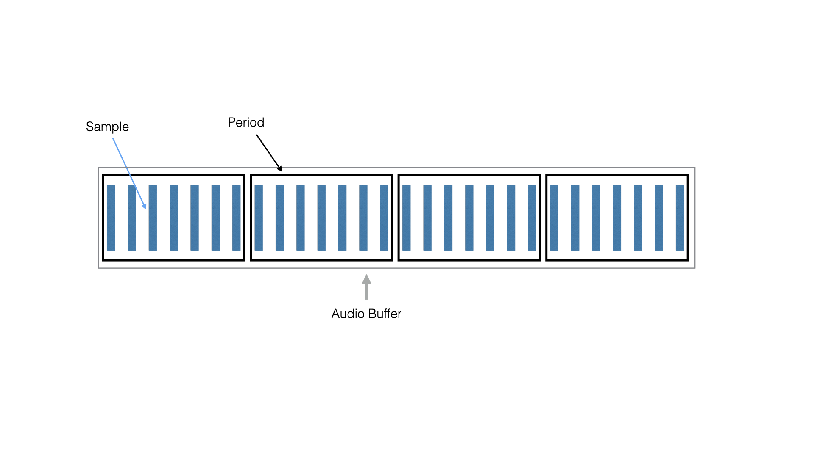
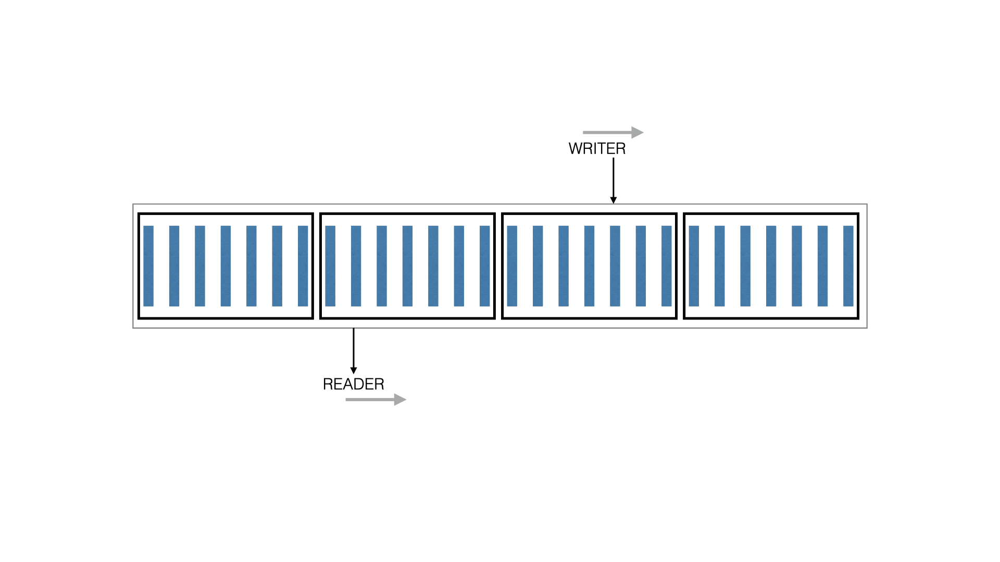

# Alsa Sound Kit - PCM

The Alsa Sound Kit (ASK) provides Objective-C wrappers around ALSA MIDI devices and ALSA PCM (sound) devices.  This chapter describes how sound devices are configured and how sounds are played or captured. 

## ALSA PCM System Overview

The Advance Linux Sound Architecture (ALSA) library calls a device that can translate continuous sound waves into a series of samples a "PCM" (PCM stands for Pulse Code Modulation).  ALSA PCM devices can PLAY and CAPTURE sounds.

In your system, a sound capability is provided by a "card."  These days, a sound card is usually integrated directly into your laptop motherboard.  When you plug a USB audio device into your system, that will appear as a card too.  A card can have one or more devices.  Some of the devices can play or capture audio, and there can be devices for MIDI or other functions too.  For our purposes here, we'll be focusing just on the devices that play or capture audio.

On a Linux computer, you can list sound devices using the `aplay` command.  This command can also play audio samples.  Try it out like this.

``` console
$ aplay /usr/share/sounds/alsa/Front_Center.wav 
Playing WAVE '/usr/share/sounds/alsa/Front_Center.wav' : Signed 16 bit Little Endian, Rate 48000 Hz, Mono
```

If all goes well, you'll hear a sound saying "Front. Center." and you'll see the output above.

To list the audio cards and devices in your system use `aplay -l`.  On our laptop at McLaren Labs, it produces the following output.

``` console
$ aplay -l
**** List of PLAYBACK Hardware Devices ****
card 0: HDMI [HDA Intel HDMI], device 3: HDMI 0 [HDMI 0]
  Subdevices: 1/1
  Subdevice #0: subdevice #0
card 0: HDMI [HDA Intel HDMI], device 7: HDMI 1 [HDMI 1]
  Subdevices: 1/1
  Subdevice #0: subdevice #0
card 0: HDMI [HDA Intel HDMI], device 8: HDMI 2 [HDMI 2]
  Subdevices: 1/1
  Subdevice #0: subdevice #0
card 0: HDMI [HDA Intel HDMI], device 9: HDMI 3 [HDMI 3]
  Subdevices: 1/1
  Subdevice #0: subdevice #0
card 0: HDMI [HDA Intel HDMI], device 10: HDMI 4 [HDMI 4]
  Subdevices: 1/1
  Subdevice #0: subdevice #0
card 1: PCH [HDA Intel PCH], device 0: CS4208 Analog [CS4208 Analog]
  Subdevices: 1/1
  Subdevice #0: subdevice #0
card 1: PCH [HDA Intel PCH], device 1: CS4208 Digital [CS4208 Digital]
  Subdevices: 1/1
  Subdevice #0: subdevice #0
```

We can see that there are two "cards" in the system.  Card 0 is dedicated to HDMI output.  Card 1 provides audio output to the speakers and headphones of the laptop and can capture from the microphone.

> Aside: In ALSA, a hardware card/device combo is referred to with name in a special format.
> 
> ```
> "hw:%d,%d"
> ```
> 
> So to refer to our built-in audio card, we would use "hw:1,0".

If you plug a USB device into your computer, you can see a new "card" appear.  Here, we've plugged in a USB playback and capture device.  Using `aplay -l`, we see the following new device.

``` console
$ aplay -l
...
card 3: Device [USB Audio Device], device 0: USB Audio [USB Audio]
  Subdevices: 1/1
  Subdevice #0: subdevice #0
```

Each of these sound devices has a "device name" and a "display name" in the Alsa Sound Kit.  For these hardward devices, the "device name" is its card/device combo referred to in a special format: `"hw:%d,%d"`.  The "display name" of the device is the more human-friendly string at the end of the line in square brackets.  In our system, we have the following pairs.

| Device Name | Display Name |
|-------------|--------------|
| hw:0,0      | HDMI 0       |
| hw:0,1      | HDMI 0       |
| hw:0,2      | HDMI 0       |
| hw:0,3      | HDMI 0       |
| hw:1,0      | CS4208 Analog|
| hw:1,1      | CS4208 Digital|
| hw:3,0      | USB Audio    |


### Other (pseudo) Devices

ALSA provides a plug-in architecture that allows for virtual PCM devices.   Some of these devices can be used to playback or capture sounds, others process or modify PCM (waveform) buffers.  You can see a list of them using `aplay -L`.

The output of this command does not make it apparent which of these devices can be used for playback or capture: that information is embedded in the ALSA system  and is available through C functions.  Fortunately, the Alsa Sound Kit is aware of how to find these.  For these pseudo-devices, their "device name" (the name used in code) is the same as their "display name."

On our system, the following pseudo-devices are available.

| Device Name | Display Name |
|-------------|--------------|
| default     | default      |
| null        | null         |
| pulse       | pulse        |

A Linux Audio system is usually configured with the "default" and "null" pseudo-devices available.  The "default" device corresponds to whatever is selected as the desktop speaker and microphone in a standard setup.  The "null" device is a special device that drops all samples sent to it, and produces "zeroes" when used as a capture device.

Our system alsa has a pseudo-device for "pulse" - the "Pulse Sound Server".

## Pulse and JACK

Pulse and JACK are both audio sound servers.  Each of these "takes over" a hardware device and provides a virtual interface for application programs to use.

JACK is used in high-performance audio environments and provides an "audio-bus" abstraction for sharing low-latency audio streams between applications.  JACK is not configured by default on many Linux systems, but is easy to install.  Programs that make the optimal use of JACK use the JACK API directly rather than ALSA.  (Note: JACK can also provide access via an ALSA Virtual PCM.)

Pulse is used on the desktop to multiplex the one selected hardware audio device between all of the applications on the desktop.  ALSA applications that open the "default" or "pulse" audio device on a Pulse-enabled system actually open a port to the Pulse sound server, which then mixes its sound output with other applications that are producing sounds at the same time.

Pulse makes applications more friendly on the desktop, but adds a little bit of latency.  If your target application is a realtime synthesizer, for instance, it is advisable to bypass Pulse and access a hardware (non-virtual) device directly.

> Note: Pulse and pasuspender
> 
> When an audio device is in use by Pulse, it is "busy" for other applications.  If you need to temporarily pause Pulse
> and make it release a device, use the `pasuspender` command.
>
> $ pasuspender -- pgm args ...


## ASK Pcm

An `ASKPcm` object is the Alsa Sound Kit wrapper for an ALSA Pcm handle.  The `ASKPcm` interface provides methods for:

* opening a PCM
* querying its capabilities
* configuring its parameters
* registering audio callback blocks
* starting and stopping the audio thread

This section will describe how to open and configure an audio device, and how to play a sound.


### Open a PCM

The initializer for an `ASKPcm` opens the named ALSA device for playback or capture.  The ALSA "device name" should be specified.

``` objc
  NSError *error;
  ASKPcm *pcm = [[ASKPcm alloc] initWithName:@"default"
                                      stream:SND_PCM_STREAM_PLAYBACK // or SND_PCM_STREAM_CAPTURE
                                       error:&error];
```

If the PCM cannot be opened because then name doesn't exist, or because it is in use by another program, or because it is not usable for the "stream" specified there will be an error returned.


## Configure a PCM

Once a PCM is opened, it must be configured for use.  This involves setting two sets of parameters: the Hardware Parameters, and the Software Parameters.

The Hardware Parameters necessary include the sample rate, the number of channels (stereo or mono), the memory layout of the samples (interleaved or noninterleaved) and the format (16-bit unsigned integer, 32-bit signed, float, etc) of the samples.  It is also necessary to set the period size and number of periods, or equivalently the total buffer size and number of periods.

### What is the period size?

The period size is the number of samples transferred to an audio device as a unit.   A user program needs to be able to write new samples to a memory area different than that
being transferred, so there must be at least room for *at least* two periods worth of samples in the buffer. But in some applications it may be useful to size the buffer large enough to hold three or four periods of samples. These parameters are the "period size" and "number of periods."  The total "buffer size" equals the "period size" multiplied by the "number of periods."




### How Readers and Writers share the Audio Buffer

Whether your PCM device is a PLAYBACK or a CAPTURE device, there is a circular buffer between your code and the hardware.  In the case of PLAYBACK, your audio thread is writing samples to the buffer, and the hardware device is reading samples from the buffer.  The figure below illustrates the relationship.



The choice of hardware parameters and your algorithm design must all cooperate for this to work smoothly.  If the software cannot produce new samples at the rate the hardware is consuming them, then a condition known as an "underrun" occurs.   If the software is designed to efficiently produce large chunks of audio, this may reduce the occurrence of underruns, but it can increase the total latency of the system.  Balancing the parameters with the algorithm design of your software is an art in itself.

### Set the Hardware Parameters

The Hardware Parameters are described by an `ASKPcmHwParams` object.  A HW Params object describes a space of configuration variables that the device might support.  For each of the Hardware Parameters, the `ASKPcmHwParams` holds a minimum and maximum value that might be satisfied by the device.

To set the Hardware Parameters of a PCM you must first get its `ASKPcmHwParams` with the following method call.

This object can be inspected by printing it.

``` objc
   ASKPcmHwParams *hwparams = [pcm getHwParams:&error];
   NSLog(@"%@);
```

On our laptop, if we open PCM named "hw:1,0" (the Intel CS4208 Analog device), we see the following output.  For each parameter, the currently selected value is followed by its allowed range in parentheses.  A "U" means the current value is unspecified.

``` console
2020-12-29 14:17:38.025 miniosc1[104007:104007] ALSA-HWPARAMS chan:U(2,4) rate:U(32000,192000), 
  period:U(8,8192), periods:U(2,32), bufsize:U(16,16384) 
    buftime:U(83,512000) access:<U>:("MMAP_INTERLEAVED", "RW_INTERLEAVED") 
      format:<U>:("S16_LE", "S32_LE")
```


This device supports the following Hardware Parameters ranges:

* it supports from two to four channels
* a sample rate between 32000 and 192000 samples per second
* a period size of 8 to 8192
* the number of periods from 2 to 32
* a buffersize from 16 to 16384 (buftime is the bufsize divided by sample rate)
* an Interleaved memory access pattern
* and signed 16-bit or 32-bit little endian integers

That's a lot of information!  And it turns out that many combinations of values allowed by the ranges do not necessarily work.  Very tiny periods stress the CPU beyond what it can deliver.  (Note: if experimenting with your computer, trying a very low period size may hang your system!)  Period sizes that are too large limit the total number of periods.

In any event, one by one, we must set all of these parameters to something allowed.  For instance, we might set the sample rate first to 44100.  

``` objc
  ok = [pcm setRate:hwparams val:44100 error:&error];
  if (ok == NO) {
    NSLog(@"Error setting rate:%@", error);
    exit(1);
  }
  NSLog(@"%@", hwparams);
```

If we did, and we printed out the new HW Params object, it would look like the following.  The current value of the rate parameter is 44100 instead of "U".

``` console
2020-12-29 14:27:54.640 miniosc1[104338:104338] ALSA-HWPARAMS chan:U(2,4) rate:44100(44100,44100), 
  period:U(8,8192), periods:U(2,32), bufsize:U(16,16384) 
    buftime:U(362,371520) access:<U>:("MMAP_INTERLEAVED", "RW_INTERLEAVED") 
      format:<U>:("S16_LE", "S32_LE")
```

Our example program `examples-ask/miniosc.m` shows how to set the Hardware Parameters in turn.  The order our program sets them is this.

* set sample rate
* set number of channels (2)
* set access pattern (INTERLEAVED)
* set format to S32_LE
* set the number of periods as near to 2 as possible
* set the period size to 1024 samples

Once the `ASKPcmHwParams` object has been configured, the PCM is set to use these values.

``` objc
// Now set the HW params
ok = [pcm setHwParams:hwparams error:&error];
if (ok == NO) {
  NSLog(@"Could not set hw params:%@", error);
  exit(1);
}
```

### Set the Software Parameters

The Software Parameters describe some of the characteristics of how the buffer of samples is transferred to the audio device.  These follow the same pattern of first getting the current Software Paramters, adjusting the values and setting the parameters.  The following works for most devices.

``` objc
// Set Software Parameters
ASKPcmSwParams *swparams = [pcm getSwParams];

ok = [pcm setAvailMin:swparams val:persize error:&error];
if (ok == NO) {
  NSLog(@"Error setting avail min:%@", error);
  exit(1);
}
  
ok = [pcm setStartThreshold:swparams val:0 error:&error];
if (ok == NO) {
  NSLog(@"Error setting start threshold:%@", error);
  exit(1);
}

ok = [pcm setSwParams:swparams error:&error];
if (ok == NO) {
  NSLog(@"Could not set sw params:%@", error);
  exit(1);
}
```

The `ASKPcmSwParams` object can be inspected too.  It looks like this for the device we opened earlier.

``` console
2020-12-29 14:41:47.412 miniosc1[104884:104884] ALSA-SWPARAMS tstampmode:NONE amin:1024 per:0 start:1 stop:2048 sil:0 size:0
```

## Set the Callbacks

An `ASKPcm` manages the audio thread and collects samples for playing (or capturing) through callback blocks.  For a playback PCM, the block is defined with the `onPlayback:` method.  The block specified must produce one period's worth of frames each time it is called (the parameter `nframes` will be the period size).

``` objc
[pcm onPlayback:^(snd_pcm_sframes_t nframes) {
  return (void*) wav;
}];
```

The block must return the samples of the period as a `void*`.  The samples must match the "format" and "access" specified when setting the Hardware parameters.

After the samples are written to the PCM, a second block is called.  This block can be used by user-code for maintenance operations.

``` objc
[pcm onPlaybackCleanup:^{
    // ... do something after the samples were transferred to the PCM
}]
```

There is also a callback block that can receive an error.  The value passed to the block is the ALSA error code.

``` objc
[pcm onPlaybackThreadError:^(int err) {
  NSLog(@"Got Thread Error:%d", err);
  exit(1);
}];
```

### Capture Callbacks

For a capture PCM, there are two callbacks.  The first must return a pointer to a memory area big enough to hold a periods worth of samples.  The second is called after the samples have been written there.

``` objc
[pcm onCaptureBufferBlock:^{
  return (void*) wav;
}]

[pcm onCapture:^(snd_pcm_sframes_t nframes) {
  // ... handle the frames written to *wav
}]
```

There is also a callback block that can receive an error.  The value passed to the block is the ALSA error code.

``` objc
[pcm onCaptureThreadError:^(int err) {
  NSLog(@"Got Thread Error:%d", err);
  exit(1);
}];
```

### An example oscilator: A440

The example program in `examples-ask/miniosc1.m` sets up a PCM and plays a SINE-wave note: an A440.  The code setting up the sample buffer and filling it with samples is shown below.  There are some interesting things coded here that point to some of the tedium of working with PCM devices: many of the obtained hardware parameters place requirements on the C code written.

* the frequency increment (`dphi`) is a function of sample rate
* the size of the data buffer is dependent not only on period size, but sample format (`int32_t`)
* the access pattern (interleaved) is reflected in the loop

``` objc
// Create a waveform: A440
__block double phi = 0;

double dphi = (2 * M_PI) * 440.0 / 22050.0;
NSData *data = [NSMutableData dataWithLength:(2 * persize * sizeof(int32_t))];
int32_t *wav = (int32_t*) [data bytes];

// Install callback
[pcm onPlayback:^(snd_pcm_sframes_t nframes) {
  for (int i = 0; i < 1024; i++) {
    double sound = sin(phi) * (1 << 24);
    wav[i*2] = sound;
    wav[i*2 + 1] = sound;
    phi += dphi;
    if (phi >= 2*M_PI) {
        phi -= 2*M_PI;
    }
  }
  return (void*) wav;
}];

```

The use of the block as a callback lends some conveniences however. The variables and memory buffer used inside the block are "captured" by the compiler.  Without blocks, an equivalent callback function would need more arguments.  Blocks make the callback from the audio thread easier to write.

### Rules on the Callback Blocks

The `ASKPcm` sets up and runs the audio thread.  The callback blocks execute in the context of the audio thread.  You must be very careful about what operations your code performs in these blocks.

* An operation that could cause the code to "block" can (will!) create audio artifacts!
    * Do not perform memory allocation.
    * Do not read or write files.
    * Do not use locks.

The reason that the blocks are alright is that they are allocated *before* the audio thread starts playing them.

A great article about some common pitfalls of audio thread programming is this:

* [Four common mistakes in audio development](http://atastypixel.com/blog/four-common-mistakes-in-audio-development/) by Michael Tyson

Another great article is this one by Ross Bencina:

* [Real-time audio programming 101: time waits for nothing](http://www.rossbencina.com/code/real-time-audio-programming-101-time-waits-for-nothing)


## Start the Audio Thread

After the `ASKPcm` is configured and the appropriate callback blocks are set, the PCM can be launched.

``` objc
// Launch the PCM Thread
ok = [pcm startThreadWithError:&error];
if (ok == NO) {
  NSLog(@"Could not start PCM thread:%@", error);
  exit(1);
}
```

If there is no error, the audio thread will play until stopped.

## Experiment with ALSA Devices

The example program `examples-ask/miniosc1.m` is a small program that shows all of the steps necessary to open a PCM device and play a tone. 

The program accepts an "device name" as an argument.  Try playing some of the different devices on your system.

``` console
$ ./miniosc1 default
$ ./miniosc1 hw:1,0
$ ./miniosc1 hw:3,0
```

You may find that some devices are silent, or that the parameters do not configure that device appropriately.  See if you can fix the parameters, format size or access to make the device play.

## Listing Available PCMs

The Alsa Sound Kit provides the `ASKPcmList` utlity class for listing the PCMs in your system.

``` objc
ASKPcmList *list = [[ASKPcmList alloc] initWithStream:SND_PCM_STREAM_PLAYBACK];
for (ASKPcmListItem *item in list.pcmitems) {
    NSLog(@"device-name:%@ display-name:%@", 
      item.pcmDeviceName,
      item.pcmDisplayName);
}
```

On our system, this produces the following output.

``` console
2020-12-30 09:17:32.146 askpcmlist[112073:112073] device-name:hw:0,3 display-name:HDMI 0
2020-12-30 09:17:32.146 askpcmlist[112073:112073] device-name:hw:0,7 display-name:HDMI 1
2020-12-30 09:17:32.146 askpcmlist[112073:112073] device-name:hw:0,8 display-name:HDMI 2
2020-12-30 09:17:32.146 askpcmlist[112073:112073] device-name:hw:0,9 display-name:HDMI 3
2020-12-30 09:17:32.146 askpcmlist[112073:112073] device-name:hw:0,10 display-name:HDMI 4
2020-12-30 09:17:32.146 askpcmlist[112073:112073] device-name:hw:1,0 display-name:CS4208 Analog
2020-12-30 09:17:32.146 askpcmlist[112073:112073] device-name:hw:1,1 display-name:CS4208 Digital
2020-12-30 09:17:32.146 askpcmlist[112073:112073] device-name:hw:3,0 display-name:USB Audio
2020-12-30 09:17:32.146 askpcmlist[112073:112073] device-name:default display-name:default
2020-12-30 09:17:32.146 askpcmlist[112073:112073] device-name:null display-name:null
2020-12-30 09:17:32.146 askpcmlist[112073:112073] device-name:pulse display-name:pulse
```

## Summary

This chapter described ALSA sound devices called "PCMs".  We gave some examples of how to examine and play the PCMs in your Linux system by using the `aplay` command.

The Alsa Sound Kit provides an `ASKPcm` object for interfacing playback and capture PCMs.  It provides methods for configuring the PCM Hardware and Software parameters.  The `ASKPcm` class also manages the audio thread and recovers from over/underrun conditions, allowing the audio programmer to focus on just the callbacks that provide playback or gather capture data.

The `ASKSeq` interface is a thin wrapper around the ALSA PCM handle itself.  It does not hide the problems of managing memory and layout for the different access types and format sizes.  For that we will introduce the `MSKContext` as part of the McLaren Synth Kit in the next chapters.


