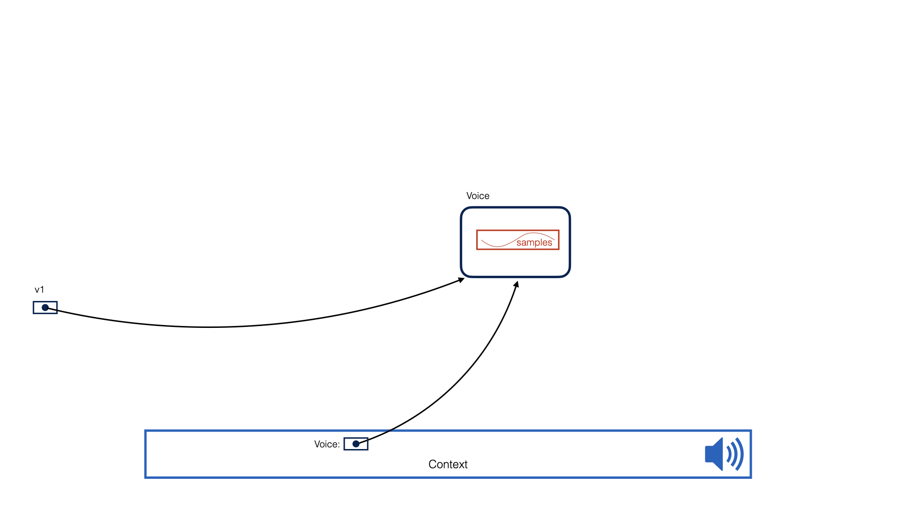
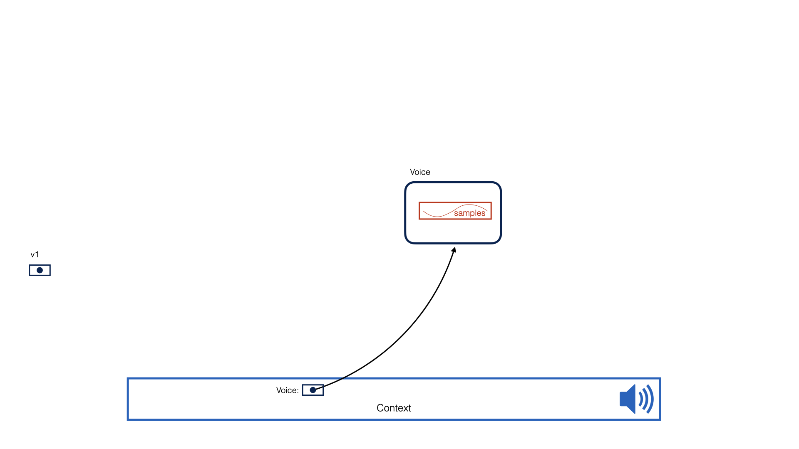
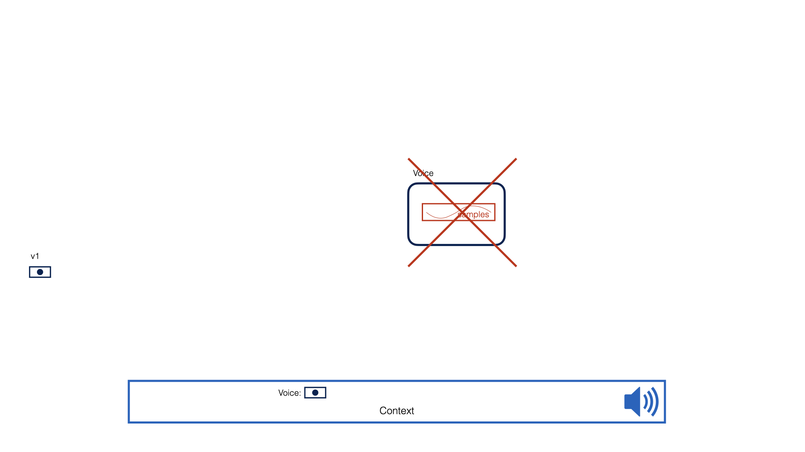
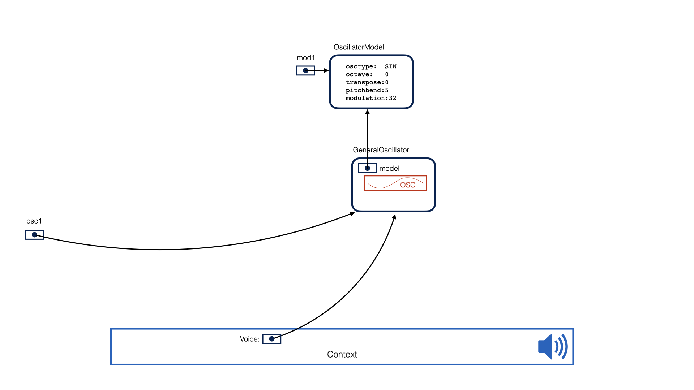
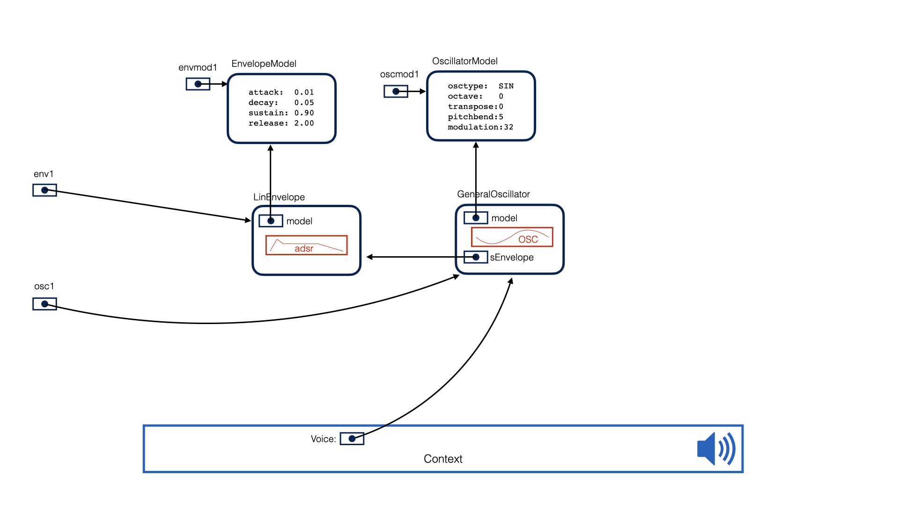
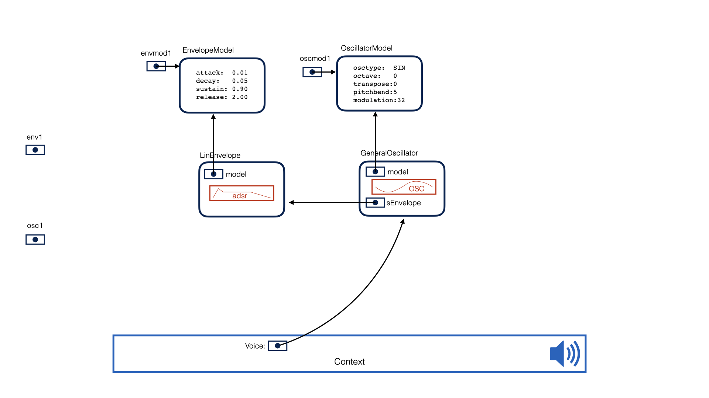
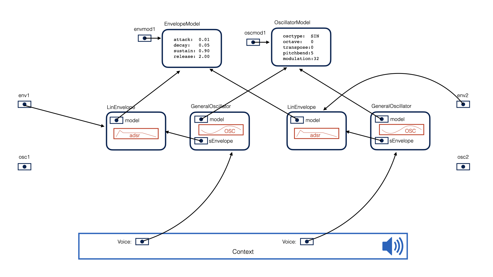

# McLaren Synth Kit - Overview

In the previous chapter, we saw how to work with a PCM to deliver samples to an audio device.  Working directly with an audio device exposes many of the hardware parameters to the underlying code.  Parameters such as sample rate, period size, access pattern and sample type all must be accounted for.

The Mclaren Synth Kit (M.S.K.) presents a level of abstraction above that of the PCM.  It has been designed to use Objective-C to design audio generators as a connected graph of low-level audio units called Voices.  This chapter describes how to set up and use the standard components of the Mclaren Synth Kit.

The `MSKContext` class is the foundation of the Synth Kit.  An `MSKContext` opens and manages a PCM.  It schedules the necessary audio callback blocks and evaluates the voices of the audio graph to generate sounds.

An `MSKContext` also allocates a dispatch queue for timing and for callbacks.  As we learned earlier, it is important that the callbacks on the audio thread do not perform blocking operations.  The `MSKContext` and its voices implement a protocol for getting information *into* and *out-of* the audio thread.  By following the guidelines of this protocol you are ensured to avoid audio glitches or pops.


## MSK Context

The `MSKContext` does its best to find good hardware and software parameters for the specified PCM device.  Opening, configuring and running an `MSKContext` is straightfoward.  The snippet below shows how to open the PCM device named "default" for playback.

``` objc
NSString *devName = @"default";

NSError *error;

// Create an audio context on the 'default' device for playback
MSKContext *ctx = [[MSKContext alloc] initWithName:devName
                                         andStream:SND_PCM_STREAM_PLAYBACK
                                             error:&error];
```

Next, create a configuration request.  The request specifies the sample rate,  period size and number of periods.  These parameters are key for adjusting the latency of a synthesizer application.

``` objc
// Desired audio context parameters
MSKContextRequest *request = [[MSKContextRequest alloc] init];
request.rate = 44000;
request.persize = 1024;
request.periods = 2;
```

Now, configure the Context with the Request.

``` objc
BOOL ok;
// Configure the context with the request
ok = [ctx configureForRequest:request error:&error];
```

If there is no error, the Context has successfully configured the underlying PCM.  You can observe the achieved Hardware and Software parameters in the `hwparams` and `swparams` property of the Context.

``` objc
  NSLog(@"%@", ctx.hwparams)
  NSLog(@"%@", ctx.swparams)
```

> Aside: the Context exposes many of its internal variables as readonly properties.  One of the design decisions
> behind the Mclaren Synth Kit is that useful implementation variables should be exposed rather than hidden in 
> a private category.

Before the Context produces any sound, it needs to be started.  This call does two things: it starts the underlying PCM thread, and it launches a dispatch queue timer for monitoring status information coming out of the audio callback.

``` objc
// Start the context
ok = [ctx startWithError:&error];
```

## MSK Voice

A Voice consists of a sample buffer and some callback functions that fill the buffer with samples.  In the Mclaren Synth Kit there are voices that create sounds and voices that control the parameters of other voices.   All are children of the `MSKContextVoice` base class.

The `compile` method of a Voice must be called after it is attached to other objects.

A Voice can be played by a Context by adding it to the Context with the `addVoice:` method.


``` objc
MSKContextVoice *v1 = [[MSKContextVoice alloc] initWithCtx:ctx];
[v1 compile];
[ctx addVoice:v1]
```

It is useful to think about the audio graph constructed by the preceding code.  A Voice referenced by the variable `v1` has been added to the Context.  The Context renders the Voice by reading its samples once every PCM period.  The Context invokes a callback function defined by the Voice to create new samples each period.

A Voice is rendered by a Context until it is no longer active.  (We'll define how Voices become "inactive" in a minute.)



## Voices and Automatic Reference Counting (ARC)

A Voice is an Objective-C object and is managed through ARC (Automatic Reference Counting) just like any other object.

A Context retains a reference to a Voice as long as it is active.  When it is no longer active, the Context releases its reference so the Voice can be reclaimed.

Consider the code below.  This creates a Voice and hands it to the Context.  After the `addVoice:` call, the variable `v1` is set to `nil`, essentially dropping the reference to the Voice.

``` objc
MSKContextVoice *v1 = [[MSKContextVoice alloc] initWithCtx:ctx];
[v1 compile];
[ctx addVoice:v1]
v1 = nil;
```

The Context still holds a reference to the Voice, however. As long as it is "active" the reference is retained.



Now, let's imagine that the Voice becomes marked "inactive".  At some point after the Voice becomes inactive, the Context will drop its reference and will stop rendering the Voice.  The reference count of the Voice will drop to zero, and ARC will reclaim the memory for the voice.




## How do Voices become Inactive?

A Voice is "active" as long as its `_active` instance variable is set to `YES`.  A freshly initialized Voice is active.  The `_active` instance variable may be set to `NO` by a number of ways.

* an external thread may directly mark a voice inactive by executing  
    `voice->_active = NO;`  
    This would cause the Voice to stop playing abruptly.

* a callback function in a Voice may mark itself inactive as part of the algorithm it implements

In the Mclaren Synth Kit, Envelope Generators are a special type of Voice that mark themselves inactive after their decay time.


## Voices and Models

A Voice is something that produces a buffer of Samples for a Context.  A Model is an Objective-C object that holds properties that affect the behavior of a Voice.  Models are designed to be updated in realtime by any number of control threads.  GUI widgets and MIDI events should update Models, but not Voices directly.

Voices are designed to read values from models on each period of the audio thread.  Models may be allocated one-for-one for a voice, or can be shared among Voices.

Models know how to save themselves to the `NSDefaults` system, and how to restore themselves as well.




## An Example

The following example illustrates how to create a SIN-wave oscillator with an Envelope generator.  We create two models: one for the envelope generator and one for an oscillator.  The name given to each model becomes part of the key the model uses when it saves itself to the `NSDefaults` system.

Next, an Envelope is created.  This one is a "linear envelope."  The envelope is configured to read its realtime configuration parameters from `envmodel1`.

After that, a SIN-wave oscillator is created using the `MSKGeneralOScillator` class.  This oscillator is given an initial note (`iNote`) value of middle-C (MIDI 60).  Its realtime parameters input is set to the `oscmodel1` model.

In MSK, Voice properties that specify initial values begin with a lowercase 'i'.

This oscillator also has an envelope input called `sEnvelope`.  In MSK, Voice properties that begin with a lowercase 's'.  The logic of the Oscillator Voice is defined such that it will mark itself "inactive" when the `sEnvelope` input becomes inactive.

Adding the oscillator to the Context causes it to begin to sound.

``` objc
MSKEnvelopeModel *envmodel1 = [[MSKEnvelopeModel alloc] initWithName:@"env1"];
envmodel1.attack = 0.01;
envmodel1.decay = 0.05;
envmodel.sustain = 0.90;
envmodel.rel = 2.00;

MSKOscillatorModel *oscmodel1 = [[MSKOscillatorModel alloc] initWithName:@"osc1"];
oscmodel1.osctype = MSK_OSCILLATOR_TYPE_SIN;
oscmodel1.pitchbend = 5;
oscmodel.mod = 32;

MSKExpEnvelope *env1 = [[MSKExpEnvelope alloc] initWithCtx:ctx];
env1.model = envmodel1;
[env1 compile];

MSKGeneralOscillator *osc1 = [[MSKGeneralOscillator alloc] initWithCtx:ctx];
osc1.iNote = 60;
osc1.sEnvelope = env;
osc1.model = oscmodel1;
[osc1 compile];

[ctx addVoice:osc1];
```

At this point, the system looks like the following figure.  Variables `env1` and `osc` hold pointers to the Envelope and the Oscillator, and the Context holds a pointer to the Oscillator.  The Oscillator, in turn, holds a pointer to the Envelope.

The Context looks to the Oscillator to produce new samples.  The Oscillator, in turn, looks to the Envelope to produce new samples.  The graph tracing from the Context to the Voices and Models defines the audio being rendered by the audio thread.



## noteOff and Decay

Envelope Voices implement a formal protocol that is shown below.

``` objc
@protocol MSKContextEnvelope

- (BOOL) noteOff;
- (BOOL) noteAbort;
- (BOOL) noteReset:(int)idx;

@end
```

Sending the `noteOff` method to an Envelope causes it to begin its release.  After the release time, the Envelope is marked inactive.

Sending the `noteAbort` method causes an Envelope to drop to 0.0 by the end of the period.  The Envelope is then marked inactive.

Sending `noteReset` causes an Envelope to start all over.

In our example, we could send the `noteOff` method to the envelope to tell it to begin its release.  We could also drop the references to the envelope and oscillator.  

``` objc
[env1 noteOff];
env1 = nil;
osc1 = nil;
```

The resulting graph would be as shown below.  The Context would still hold a reference to the Oscillator, and the Oscillator is still holding a reference to the Envelope.  The Envelope, however, has begun its release.



At the end of the release period, the envelope will mark itself "inactive" and then the oscillator will too.  The Context will then release its reference to the oscillator and the entire graph will be reclaimed.

## Two Notes with Shared Models

The example of this section will explain what happens as multiple notes are sounded with shared models.  At some point in time, a thread executes the following causing the first new note to be added to the Context. Notice that we can forget the reference to `osc1`, but that we still want to hold the reference to `env1` so we can send it the `noteOff` method later.

``` objc
MSKExpEnvelope *env1 = [[MSKExpEnvelope alloc] initWithCtx:ctx];
env1.model = envmodel1;
[env1 compile];

MSKGeneralOscillator *osc1 = [[MSKGeneralOscillator alloc] initWithCtx:ctx];
osc1.iNote = 60;
osc1.sEnvelope = env;
osc1.model = oscmodel1;
[osc1 compile];

[ctx addVoice:osc1];
osc1 = nil;
```


Some time after the first note, a second note is started by executing the following.  We pass the oscillator to the context and hold a reference to the envelope.

``` objc
MSKExpEnvelope *env2 = [[MSKExpEnvelope alloc] initWithCtx:ctx];
env2.model = envmodel1;
[env2 compile];

MSKGeneralOscillator *osc2 = [[MSKGeneralOscillator alloc] initWithCtx:ctx];
osc2.iNote = 64;
osc2.sEnvelope = env;
osc2.model = oscmodel1;
[osc2 compile];

[ctx addVoice:osc2];
osc2 = nil;
```

At this point, the Context is playing two notes: each is defined by a subgraph referenced by a pointer.  The Voices of the notes are separate, but they do share Models.  In this way, the two notes are using the same realtime parameters.



Now, assume that it is time to release the first note.  We do that by sending the `noteOff` message to its envelope.  Since we don't need a reference to the envelope anymore, we set `env1` to `nil`, and at this point the only reference to the subgraph of the first note is being held by the Context.

``` objc
[env1 noteOff];
env1 = nil;
```


After the release time of the first note, the Envelope of the first note is marked "inactive" and it stops producing samples.  Since the oscillator of the first note depends on the envelope, it too, is marked inactive.

The Context drops the reference to the subgraph of the first note, and those Voices are reclaimed.


## Complex Note with Two Oscillators

For our last example, we will describe a complex note built with one oscillator that modulates another.  An `MSKPhaseDistortionOscillator` has an additional input that modulates the phase of each sample.  This input may be any kind of Voice.

In the example shown below there are two envelope generators that share the same model.  In this way, these two envelopes will always share the same configuration parameters.  The first envelope generator is a Linear Envelope generator and it sets the gain of the simple SIN-wave oscillator.  The output of this entire first stage, rather than being rendered through the Context, is set as the input to the `sPhaseDistortion` input of a second oscillator.  This second oscillator has its own envelope generator, but it is an Exponential Envelope generator.  The output of the phase distortion oscillator is attached to the Context, so this is the sound that is rendered.


This configuration shows an interesting situation: in order to instruct both envelope generators to begin their release, our code needs to hold pointers to both of the envelopes so that it can send the `noteOff` method.

``` objc
[env1 noteOff];
[env2 noteOff];
env1 = nil;
env2 = nil;
```

As before, once the envelope has completed its release phase, it is marked "inactive" and the oscillator depending on it is marked "inactive" as well.  Then the Context releases its reference to the subgraph and the objects are reclaimed.

## The Compile Method

The `compile` method is new in 2023, and it is required after connections to other objects are made and before adding the Voice to the Context for playing.  The compile method examines the connections the Voice has made to other objects and optimizes the underlying sound generation code.  For instance, if an Oscillator has an attached Envelope, an implementation using an Envelope is chosen.  If the Oscillator has no attached envelope, then an implementation that does not read Envelope frames can be used, potentially speeding execution.

``` objc
   MSKGeneralOscillator *osc = [[MSKGeneralOscillator alloc] initWithContext:ctx];
   // ... configure the oscillator - parameters and connections to models and other voices
   [osc compile];  // your code is done connecting the oscillator to other objects
```

Oscillators, Envelopes, Filters and Effects all require calling of the `compile` method.

## Summary

This chapter provided an overview of the McLaren Synth Kit focusing on its two major classes: the `MSKContext` and the `MSKVoice`.  A Context renders sounds by traversing a subgraph of Voices, each of which is a sample buffer with attached sound generator functions.

The Context and the Voices cooperate to implement memory management and reclamation of Voices through a simple protocol that hides the details of how ARC is performed outside of the audio thread.    This eliminates one source of error an audio program might create that could introduce audio artifacts.  Sound design then becomes the construction of a graph and its traversal.
